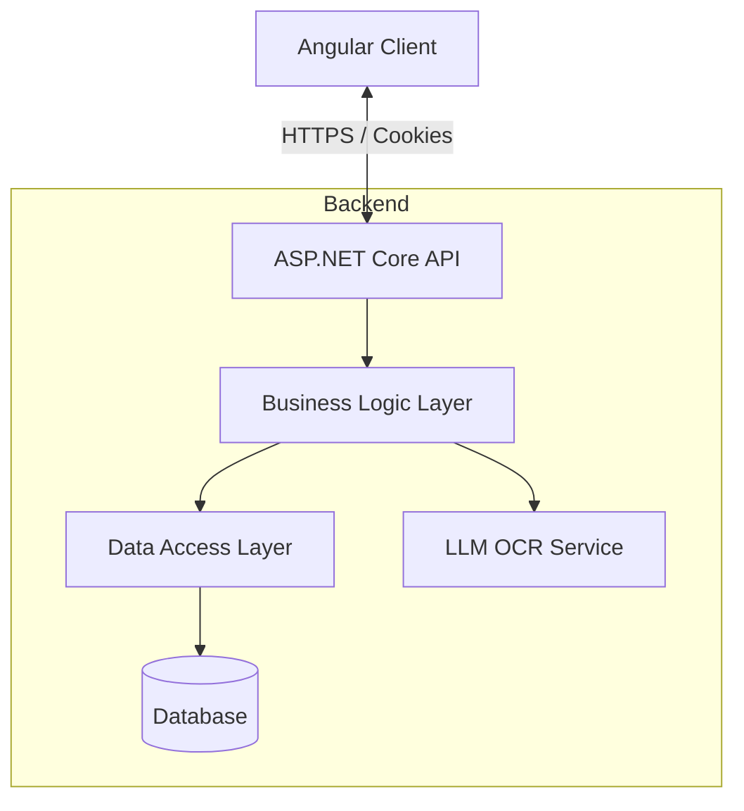

# Project Plan: Expense Tracker with OCR

## 1. Architecture Overview

### Backend: ASP.NET Core Web API
We will strictly follow a **3-Tier Architecture** to ensure separation of concerns:
1.  **Presentation Layer (API)**: Controllers receiving HTTP requests.
2.  **Business Logic Layer (Services)**: Core logic, validations, and OCR processing coordination.
3.  **Data Access Layer (Repository)**: Direct interaction with the Database using Entity Framework Core.

**Key Technologies:**
-   .NET 8 / 9
-   Entity Framework Core (MySQL)
-   AutoMapper (for DTO mapping)

### Frontend: Angular
1.  **Framework**: Angular (Latest)
2.  **Styling**: Tailwind CSS
3.  **Components**: Reusable UI components for Tables, Charts, and Forms.

### Authentication
-   **Mechanism**: Session-based (Cookie Authentication).
-   **Flow**: The API will issue an `HttpOnly` cookie upon successful login. The browser will automatically handle sending this cookie for credentials.

### OCR Feature
-   **Integration**: LLM-based OCR (e.g., OpenAI Vision or Gemini Vision API).
-   **Flow**: Upload Receipt Image -> Backend sends to LLM -> LLM returns JSON (Amount, Date, Vendor) -> Frontend pre-fills form.

## 2. Todo List

### Phase 1: Setup & Foundation
- [ ] Initialize ASP.NET Core Solution with 3 layers.
- [ ] Initialize Angular application.
- [ ] Configure Tailwind CSS.
- [ ] Setup Database Context and User Entity.

### Phase 2: Authentication
- [ ] Implement Registration Service.
- [ ] Implement Login Service (Cookie logic).
- [ ] Create Angular Auth Guard and Interceptors (to handle 401s).

### Phase 3: Core Features (Expenses)
- [ ] Create Expense and Category Entities.
- [ ] Implement CRUD Repositories.
- [ ] Build "Add Expense" Form in Angular.
- [ ] Build "Expense List" with filtering/sorting.

### Phase 4: Dashboard & Analytics
- [ ] Create Dashboard Service (aggregating data).
- [ ] Implement Charts (using a library like `ng2-charts` or `chart.js`).
- [ ] Display KPIs (Total Spent, Monthly Budget, etc.).

### Phase 5: OCR Integration
- [x] Implement File Upload Endpoint.
- [x] Integrate LLM Client for image analysis.
- [x] Connect "Scan Receipt" button to this flow.

## 3. Architecture Diagram (Conceptual)

